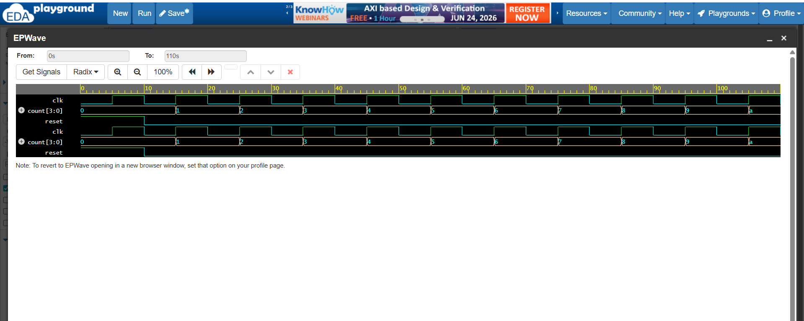

# CODETECH_TASK2

## Basic ALU Implementation using Verilog HDL

### Project Overview

This project focuses on designing and implementing a 4-Bit Arithmetic Logic Unit (ALU) using Verilog HDL. The ALU performs various arithmetic and logical operations based on the select input signal. EDA Playground and EPWave were used to simulate and verify the design.

### Objectives

* Design a 4-Bit Arithmetic Logic Unit using Verilog HDL.
* Implement basic arithmetic and logical operations.
* Verify the functionality of the ALU through simulation and waveform analysis.
* Gain practical experience in digital circuit design and VLSI concepts.

### Operations Performed

| Select (sel) | Operation |
|-------------|-----------|
| 000 | Addition (A + B) |
| 001 | Subtraction (A - B) |
| 010 | Bitwise AND (A & B) |
| 011 | Bitwise OR (A \| B) |
| 100 | Bitwise XOR (A ^ B) |
| 101 | Bitwise NOT (~A) |
| 110 | Left Shift (A << 1) |
| 111 | Right Shift (A >> 1) |

### Tools Used

* Verilog HDL for designing the ALU.
* EDA Playground for simulation.
* EPWave for waveform analysis.
* GitHub for project documentation and version control.

### Project Files

* `alu_4bit.v` – Contains the Verilog module for the 4-Bit ALU.
* `alu4bit_testbench.v` – Contains the testbench used for simulation.
* `alu_4bitwaveform.png` – Contains the simulation waveform output.

### Simulation Results
The ALU was successfully simulated for all arithmetic and logical operations. The output waveform verified the correct operation of addition, subtraction, AND, OR, XOR, NOT, left shift, and right shift functions.

### Waveform

Upload the waveform screenshot as **alu_4bitwaveform.png** and add it below:

```markdown

